# Final PJT 

## 1. 팀원 역할, PJT 주제 및 개요


#### - 이수진 (Guild, Profile, game 탭)

#### - 정인하  (Movie, Collection, Home 탭)


### - 서비스 개요

- 영화 사용자 기반 추천 서비스
- 영화 취향 주고받는 공간
- 영화 관련 관심사 소통 커뮤니티


#### A. 언어

- Python 3.9.7
- Django
- Node.js 16.13.0
- Vue.js 
  - vue/cli 4.5.15


#### B. 도구

- Vscode
- Chrome Browser

- notion

- draw.io

  

#### C. 아키텍처

- Django REAT API서버 & Vue.js

---

## 2. 기능 및 구현 내용


### - Home

- 현재 인기 영화 TOP 10 (TMDB API)
  TMDB API로 요청을 보내서 현재 인기 영화를 불러옴

- 영화추천 기능
  랜덤으로 10개의 영화를 보여주고 현재 마음에 드는 영화를 개수 제한 없이(1개 이상) 입력받음 그 입력을 바탕으로 랜덤으로 그 영화와 비슷한 영화를 추천해줌

  추천은 TMDB API의 recommendation을 활용

  

- ### Balance Game

  - Home 탭에 갈 때마다 새로운 영화 관련 주제 밸런스 게임

  - 세가지의 옵션 

  - 투표 즉시 결과 반영

  - 인증된 사용자만 투표 가능


### - Movie 

- 영화 검색 결과 해당 사이트에 등록된 영화일 경우 영화 상세페이지로 이동
- 영화 검색을 통해 영화 관련 상세 내용 확인
  - DB에 없는 영화일 경우, 등록 요청 가능
  - Admin 계정을 통해 요청받은 영화 DB 등록 또는 반려 가능
  - 등록된 영화 정보 수정(별점, 조회수는 수정 불가능)/ 등록된 영화 삭제 가능
- 등록된 영화를 등록일 순 / 조회순/ 인기순(좋아요가 많은 수)로 정렬해서 보여줄 수 있도록 함
- 가입을 통해 타 이용자 영화 리뷰 조회 가능
  - 별점 및 리뷰 남기기
  - 리뷰 및 영화에 좋아요 남기기


### - collection

- 해당 사이트 이용자가 추천하는 영화 모음 작성 가능(해당 사이트에 등록된 영화만 컬렉션에 담을 수 있음)
- 타 이용자의 collection 조회 및 좋아요 기능 
- 사용자는 컬렉션을 업데이트하고 삭제할 수 있음(본인이 만든 것에 한해)
- 컬렉션 상세 페이지로 이동시 컬렉션의 타이틀, 컬렉션 소개, 컬렉션에 담긴 영화들을 한 눈에 볼 수 있음 
- 컬렉션 검색의 경우 컬렉션의 태그와 타이틀로 검색가능하도록 구현


### - Guild


- 영화 관련 주제 중에서도 특정 관심사에 대해 Guild 생성 기능

- 태그를 통해 guild 관심사 표현 및 검색 기능

- 길드 생성 시 길드 공개 범위 설정

  - 공개 : 길드 비회원 포함 글 조회 가능
  - 비공개 : 길드 회원만 글 조회 가능

- 해당 길드 회원 : 글 작성, 해당 길드 타 이용자의 글에 코멘트 남기기, 좋아요 기능

  ​							Profile> My Guild탭에서 탈퇴  가능

- 해당 길드 비회원 : 좋아요 기능 (공개길드의 경우)

  - 가입신청 후 매니저 수락 이후 회원


- 길드 내 나뉘어진 탭을 통해 다른 내용 조회 가능
  - All Articles : 해당 길드 내 모든 글 조회
  - Recomments : 해당 길드 내 해당 이용자가 타 이용자의 글에 코멘트 남긴 글 조회
  - My Article : 해당 길드 내 해당 이용자의 모든 글 조회 및 삭제 기능
  - Favorites : 해당 길드 내 좋아요 한 글 조회 기능
- 길드 매니저 권한
  - 해당 길드 이름, 소개글, 사진 등록 및 수정, 삭제 
  - 해당 길드 검색을 위한 태그 등록 및 추가, 삭제
  - Profile > My Alram 탭에서  가입 신청 수락 및 거절
  - 탈퇴 시 해당 길드 관련 모든 내용 삭제


### - Profile

- 해당 이용자의 사이트 내 정보 모아보기 기능


- 프로필 탭 별 다른 내용 조회 기능
  - Profile 
    - 해당 이용자의 프로필 사진 등록 및 기본이미지 설정 기능
    - 닉네임 및 소개글 수정 기능
    - 해당 사이트 탈퇴 기능
  - My Feed
    - 해당 사이트 내 Guild에서 작성한 글 조회 기능
    - 해당 사이트 내 Movie에서 작성한 리뷰 조회 기능
  - My Alram
    - 길드 매니저의 경우, 가입신청시 알림 > 수락 및 거절 기능
    - 해당 사용자 길드 작성 글 좋아요 받았을 시 알림
    - - 
  - My Likes
    - 해당 사이트 Movie탭 좋아요한 영화 및 collection 모아보기 기능
  - My Guilds
    - 해당 사이트 내 해당 이용자가 가입한 길드 조회 
    - 길드 탈퇴 기능


---

## 3. 시스템 구조 및 상세 사용 기술


### Back (Django) 구조

```
final-pjt-back
  └─final-pjt-back
      │  .gitignore
      │  db.sqlite3
      │  game-data.json
      │  game_data.json
      │  manage.py
      │  README.md
      │  requirements.txt
      │
      ├─accounts
      │  │  admin.py
      │  │  apps.py
      │  │  models.py
      │  │  serializers.py
      │  │  tests.py
      │  │  urls.py
      │  │  views.py
      │  │  __init__.py
      │  │
      │  ├─migrations
      │
      ├─balancegame
      │  │  admin.py
      │  │  apps.py
      │  │  models.py
      │  │  serializers.py
      │  │  tests.py
      │  │  urls.py
      │  │  views.py
      │  │  __init__.py
      │  │
      │  ├─fixtures
      │  │      balancegame.json
      │  │
      │  ├─migrations
      │
      ├─collection
      │  │  admin.py
      │  │  apps.py
      │  │  models.py
      │  │  tests.py
      │  │  views.py
      │  │  __init__.py
      │  │
      │  ├─migrations
      │
      ├─guilds
      │  │  admin.py
      │  │  apps.py
      │  │  forms.py
      │  │  models.py
      │  │  serializers.py
      │  │  tests.py
      │  │  urls.py
      │  │  views.py
      │  │  __init__.py
      │  │
      │  ├─migrations
      │
      ├─media
      │  ├─guild_img
      │  │
      │  └─origins
      │
      ├─movies
      │  │  admin.py
      │  │  apps.py
      │  │  models.py
      │  │  serializers.py
      │  │  tests.py
      │  │  urls.py
      │  │  views.py
      │  │  __init__.py
      │  │
      │  ├─migrations
      ├─server
      │  │  asgi.py
      │  │  settings.py
      │  │  urls.py
      │  │  wsgi.py
      │  │  __init__.py
      │
      ├─static
      └─venv
```


### - Url

#### A. Movies 앱

예상치 못한 상황으로 collection과 movies 모두를 movie 앱에서 관리하게 되었음.

```python
from django.urls import path, include
from . import views

app_name = 'movies' 
urlpatterns = [
    # 영화 추천 기능 
    path('recommendations/', views.movie_recommendation),
    # 요청온 영화 vue에서 검색해서 TMDB에서 json data받아서 
    # data에 실은 후에 요청 
    path('<int:val>/', views.movie_list_and_create),  # 권한: admin만
    # 등록된 영화 수정 & 삭제하기
    path('change/<int:api_id>/', views.movie_update_and_delete),
    # 등록 요청 온 영화를 보여주는 url & 등록 요청 폼을 생성하는 url
    path('request/', views.request_list_and_create),    # 권한: admin만
    # 영화 등록 폼 삭제하기 
    path('request/<int:form_pk>/', views.delForm),
    # 단일 영화 상세페이지
    path('detail/<int:api_id>/', views.movie_detail),
    # # 영화 좋아요한 유저 수 & 영화 좋아요하기
    path('<int:movie_pk>/like/', views.like_cnt_and_create), 
    # 해당 영화에 좋아요 눌렀는지 여부 확인
    path('<int:movie_pk>/isLiked/', views.isLiked),
    # 검색어로 DB내에서 찾기
    path('search/<str:keyword>/', views.searchKeyword),
    # review like/like누른 유저 수
    path('<int:review_pk>/review/like/', views.review_like_cnt_and_create),
    # 해당 리뷰에 좋아요 눌렀는지 여부 확인
    path('<int:review_pk>/review/isLiked/', views.isReviewLiked),
    # review 쓴 user 정보 가져오기
    path('<int:review_pk>/review/user/', views.get_review_user),
    # review list 가져오기 & review 생성하는 url
    path('<int:movie_pk>/review/', views.review_list_and_create),
    # api에서 불러온 영화가 DB에 있는 영환지 확인
    path('<int:api_id>/check/', views.isInDB),

    # 만들어진 모든 collection을 반환 & collection을 create
    path('collection/<int:val>/', views.collections_list_and_create),
    # pk로 collection 찾기
    # path('collection/get/<int:collection_pk>/', views.get_collection),
    # collection에 좋아요 눌렀는지 여부 확인
    path('<int:collection_pk>/collection/isLiked/', views.isCollectionLiked),
    # collection 좋아요한 유저 수 /collection like
    path('<int:collection_pk>/collection/like/', views.collection_like_cnt_and_create),
    # keyword로 collection title 검색
    path('search/collection/<str:keyword>/title/', views.search_collection_title),
    # keyword로 collection tag 검색
    path('search/collection/<str:keyword>/tag/', views.search_collection_tag),
    # 해당 컬렉션의 작성자와 로그인한 유저가 같은지 확인
    path('collection/user/<int:collection_pk>/', views.is_collection_user),
    # 해당 컬렉션 수정 및 삭제
    path('collection/change/<int:collection_pk>/', views.collection_update_and_delete),
    # 해당 컬렉션의 태그들 가져옴
    path('collection/<int:collection_pk>/tags/', views.get_collection_tags),

    # 프로필의 My likes에서 유저가 좋아요한 영화나 컬렉션 전체 들고오기
    path('get/mylikes/<int:val>/', views.get_my_likes),

]
```


#### B.  Accounts 앱

```python
urlpatterns = [
   # 회원 가입 기능 
   # 'POST'
   path('signup/',views.signup),
    
   # 
   # 'POST'
   path('superuser/',views.is_superuser),
   
    # APi 요청시 토큰 조회 확인 제공
    path('api-token-auth/', obtain_jwt_token),
    
   # get_profile 해당 유저 정보 조회 or 자기소개 수정 
   # 'GET', 'PUT','POST','DELETE'
   path('profile/',views.profile),
   
   # profile_username_upload 해당 유저 이름 변경
   # 'PUT'
   path('profile_username_upload/',views.profile_username_upload),
   
   # profile_image_upload 이미지 업로드 및 수정
   path('profile_image_upload/',views.profile_image_upload)
  
]

```


####  C. Guilds 앱

```python
urlpatterns = [
	# 길드 조회 , 생성 >  매니저 등록, 태그 모델에 태그 등록
    # GET POST
    path('', views.guild_list_create),
    
    # 해당 유저의 가입 길드 조회
    # GET
    path('myguild/', views.my_guild),
    
    # 해당 길드 정보 조회 및 수정 삭제
    # GET PUT DELETE
    path('<int:guild_pk>/', views.guild_update_delete),
    
    # 현재 유저가 매니저인 길드 조회
    # GET
    path('user_manager/', views.user_manager),

    # 현재 유저 매니저 여부 확인 
    # GET
    path('<int:guild_pk>/is_manager/', views.is_manager),
    
    # 현재 유저 현재 길드 유저 확인 or 탈퇴
    # GET DELETE
    path('<int:guild_pk>/is_member/', views.is_member),
    
    # 현재 유저 현재 길드 가입신청 확인 or 가입신청 처리
    # GET POST
    path('<int:guild_pk>/guild_signup/', views.guild_signup),

    # guild_signup_list 모드 조회
    path('guild_signup_list/', views.guild_signup_list),

    # signup_admit_delete 길드 가입 요청 수락 or 거절
    # DELETE POST
    path('<int:guild_pk>/signup_admit_delete/<int:user_pk>/', views.signup_admit_delete),

    # 해당 길드 글 조회 및 생성
    # GET POST
    path('<int:guild_pk>/article/', views.article_list_create),
    
    # 해당 길드 특정 글 조회 삭제
    # GET DELETE
    path('<int:guild_pk>/article/<int:article_pk>/', views.article_detail),
    
    # is_my_guildarticle 해당 글 해당 길드에서 해당 유저가 쓴글인지 확인
    # GET
    path('<int:guild_pk>/is_my_guildarticle/<int:article_pk>/', views.is_my_guildarticle),
   	
    # 해당 길드에서 해당 유저가 작성한 글 전체 조회
    # GET
    path('<int:guild_pk>/myarticle/',views.my_article),
    
     # user_article 현재 유저의 작성 글 전체 조회
    # GET
    path('user_article/',views.user_article),
    
    #  해당 길드에서 해당 유저가 좋아요한 글만 조회
    # GET, 
    path('<int:guild_pk>/mylikearticle/',views.my_like_article),
    
    # 해당 길드의 글 타임라인에서 좋아요 수 조회 or 좋아요 클릭
    # GET POST
    path('<int:guild_pk>/article/<int:article_pk>/like/', views.article_like),

    # guild_article_cnt 해당 길드 몇번째 글인지 조회
    path('<int:guild_pk>/guild_article_cnt/',views.guild_article_cnt),


    # 해당 태그를 포함하는 길드 조회
    # GET
    path('search/<tag>/', views.search_guildtag),
    
    # 해당 태그 삭제 
    # DELETE
    path('delete_tag/<tag_pk>/',views.delete_tag),

    # update_guildtag 해당 길드 태그 추가 or 조회
    # GET POST
    path('<int:guild_pk>/guildtag_list_update/', views.guildtag_list_update),
	
    # 좋아요 알림을 위한 좋아요 동작 시 알림 조회, 생성, 삭제
    path('like_alram/<int:article_pk>/',views.like_alram),
    # like_alram_list 좋아요 알림 조회
    path('like_alram_list/',views.like_alram_list)
]
```


#### D. BalanceGame 앱

```python

urlpatterns = [
   # balanceGame 밸런스게임 조회
   # GET
   path('',views.balanceGame),
   
   # 게임 투표 반영
   # PUT
   path('vote/',views.game_vote),
    
   # vote_update 투표결과 반환(현재 질문 유지)
   # GET
   path('vote_update/<int:pk>/',views.vote_update),

]
```


### Front(Vue.js) 구조

```
component
    common
    │      Footer.vue
    │      Header.vue
    │
    ├─guilds
    │  │  CreateGuild.vue
    │  │  GuildItem.vue
    │  │  GuildList.vue
    │  │  UserGuildItem.vue
    │  │  UserGuildList.vue
    │  │
    │  ├─GuildDetail
    │  │      GuildArticle.vue
    │  │      GuildArticleItem.vue
    │  │      GuildArticleList.vue
    │  │      GuildLikeArticle.vue
    │  │      GuildLikeArticleItem.vue
    │  │      GuildLikeArticleList.vue
    │  │      GuildRecomment.vue
    │  │      GuildRecommentItem.vue
    │  │      GuildRecommentList.vue
    │  │      GuildTagItem.vue
    │  │      MyGuildArticle.vue
    │  │      MyGuildArticleItem.vue
    │  │      MyGuildArticleList.vue
    │  │
    │  └─SearchGuild
    │          SearchGuild.vue
    │          SearchGuildItem.vue
    │          SearchGuildList.vue
    │
    ├─home
    │      BalanceGame.vue
    │      PopularMovieItem.vue
    │      PopularMovies.vue
    │      UpcomingMovieItem.vue
    │      UpcomingMovies.vue
    │
    ├─movies
    │  ├─collections
    │  │      addCollection.vue
    │  │      collectionDetail.vue
    │  │      collectionList.vue
    │  │      collectionListItem.vue
    │  │      searchCollection.vue
    │  │      searchCollectionItem.vue
    │  │      updateCollection.vue
    │  │
    │  ├─movieDetail
    │  │      MovieDetail.vue
    │  │
    │  ├─movieReview
    │  │      Review.vue
    │  │      ReviewItem.vue
    │  │
    │  ├─register
    │  │      MovieForm.vue
    │  │      SearchMovieInput.vue
    │  │      SearchMovieList.vue
    │  │      SearchMovieListItem.vue
    │  │
    │  ├─searchMovie
    │  │      MovieList.vue
    │  │      MovieListItem.vue
    │  │      SearchMovies.vue
    │  │
    │  └─sortedMovies
    │          sortedMovieItem.vue
    │
    └─profile
            MyAlarmList.vue
            MyAlram.vue
            MyAlramLikeItem.vue
            MyAlramSignupItem.vue
            MyFeed.vue
            MyFeedItem.vue
            MyFeedPlace.vue
            MyGuildDetail.vue
            MyGuilds.vue
            MyLikes.vue
            MyLikesList.vue
            ProfileDetail.vue


views
│  Community.vue 
│  GuildDetail.vue
│  GuildDetailUpdate.vue
│  Guilds.vue
│  Home.vue
│  Profile.vue
│
├─accounts
│      Login.vue
│      Signup.vue
│
└─movies
        AddMovie.vue
        Movies.vue
```


---

## 4. 웹사이트 시연 및 동작성(상세화면)

### Home 화면

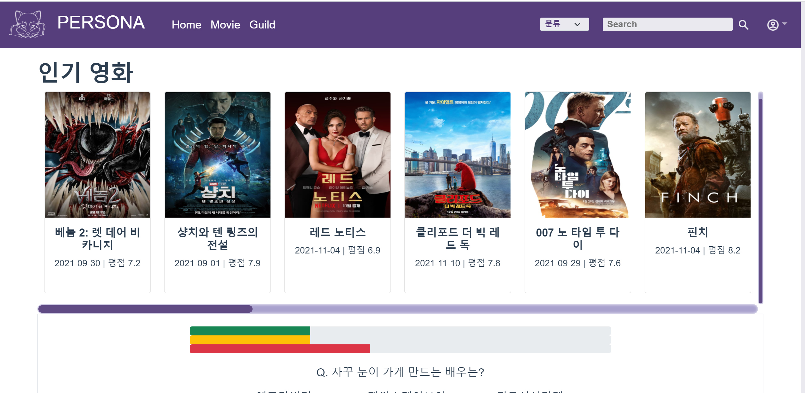

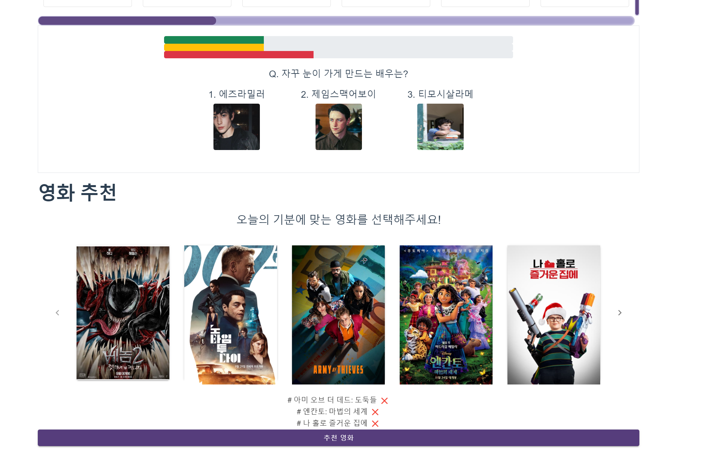

#### 추천 영화 클릭시 : 사용자가 클릭한 영화를 바탕으로 추천

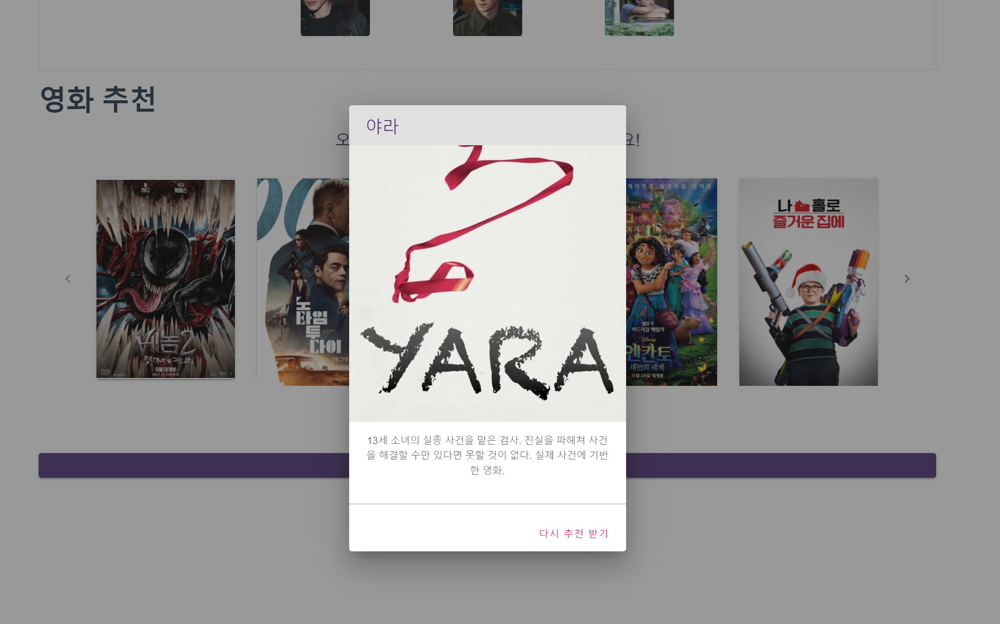


### Movie 화면

컬렉션을 업데이트 순/ 인기순으로 정렬 가능

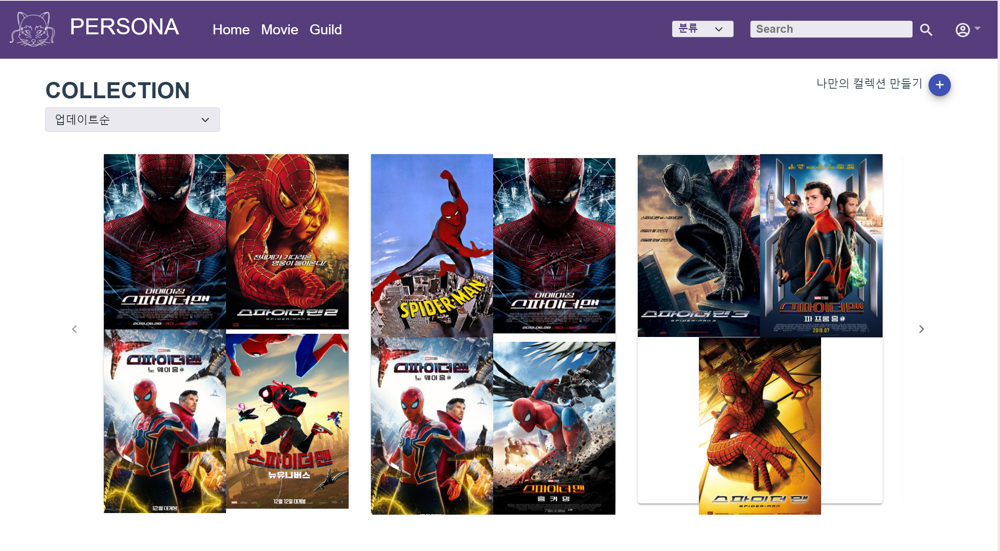


영화를 등록일 순/ 조회순/ 인기순으로 정렬 가능

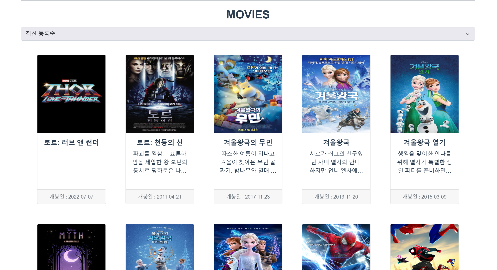


### Nav Bar에서 영화/컬렉션 검색 가능


컬렉션의 경우 태그와 제목으로 검색 가능

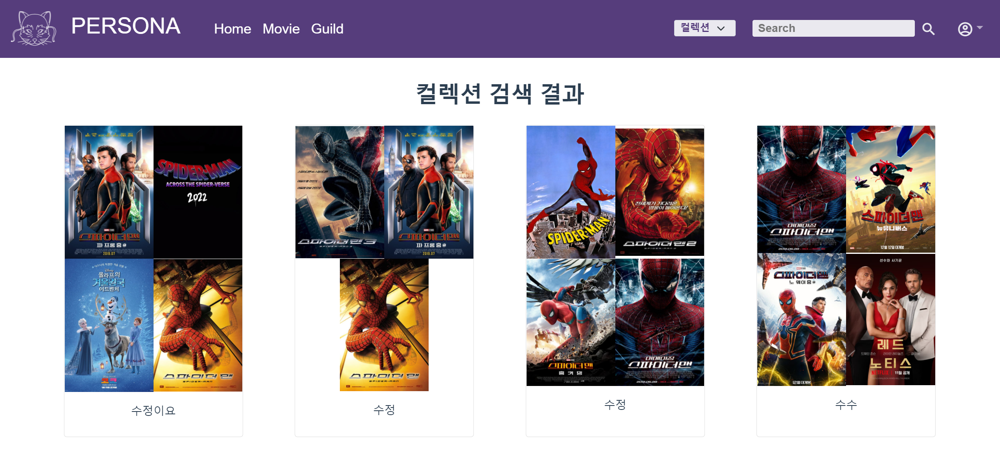

영화 검색

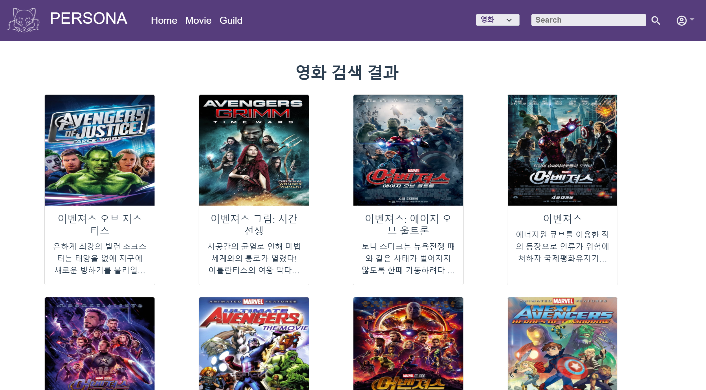


### 영화 등록 및 수정/ 삭제 가능한 ADMIN  페이지

다른 사용자들로 부터 등록 요청이 온 영화들(admin은 요청을 수락하거나 반려 가능)

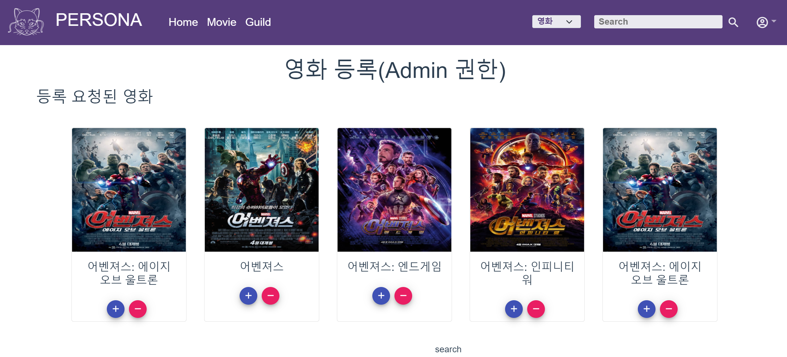

admin 페이지에서 영화를 검색한 결과 -> 등록된 영화면 수정과 삭제 버튼이 나타남

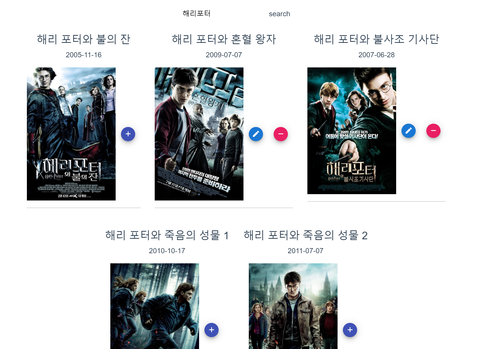

### 프로필 페이지

이미지 선택, 삭제 가능/ 닉네임 변경과 자기소개 입력 가능/ 회원 탈퇴 가능

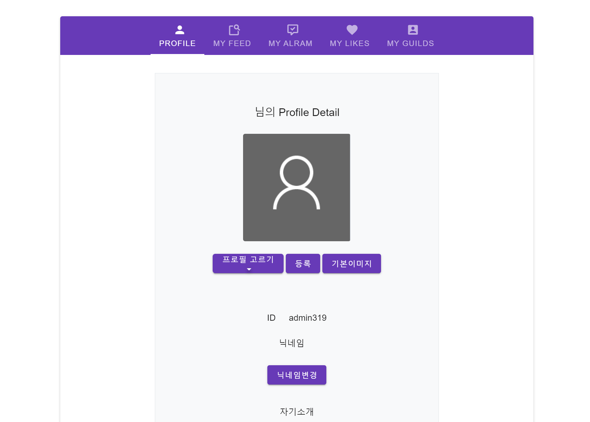


### 길드 탭 페이지

내 프로필과 내가 속한 길드 확인 가능/ 길드 선택시 길드의 피드로 이동

마이 길드와 전체 길드 확인 가능

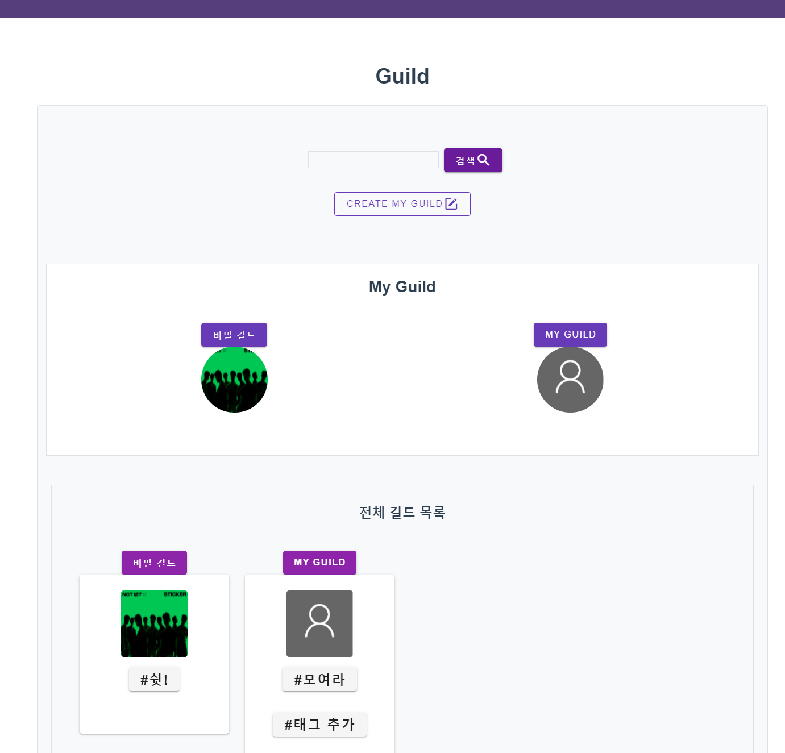

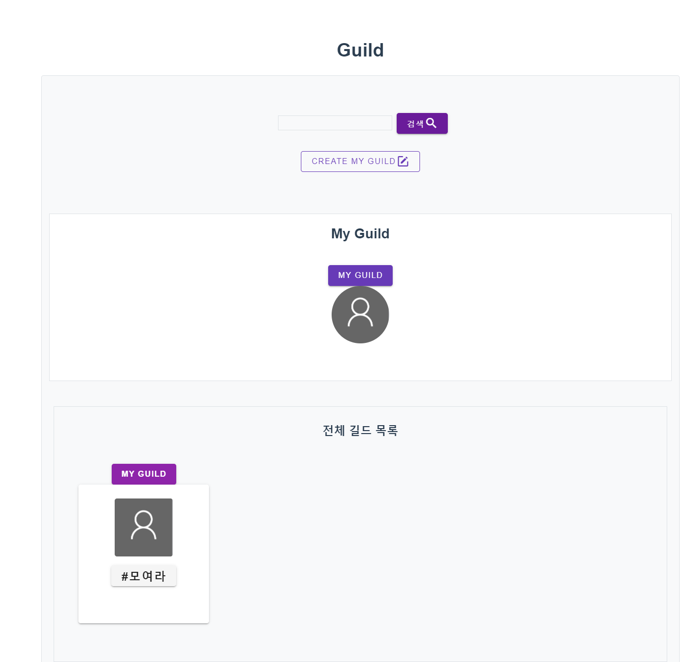


### 길드 생성 페이지

길드 생성시 길드를 표현할 태그와 길드 공개 여부, 길드 프로필 사진 선택 가능

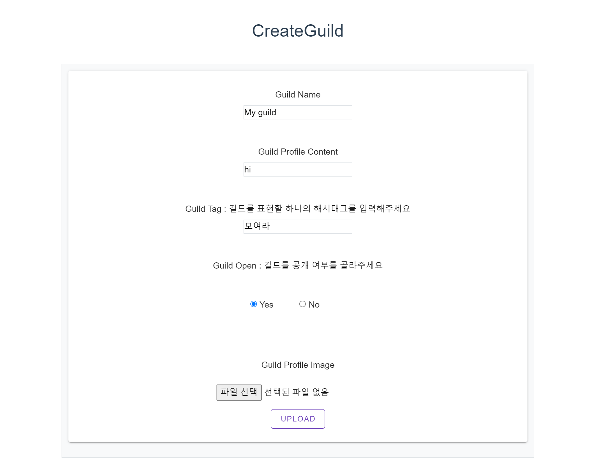


### 특정 길드의 피드

길드를 표현할 태그 추가 가능/길드 프로필을 업데이트 또는 삭제 가능(길드의 매니저의 고유 권한)

이 외에도 글 작성/ 작성된 글을 리코멘트/ 내가 작성한 글/내가 좋아요한 글 보기 가능

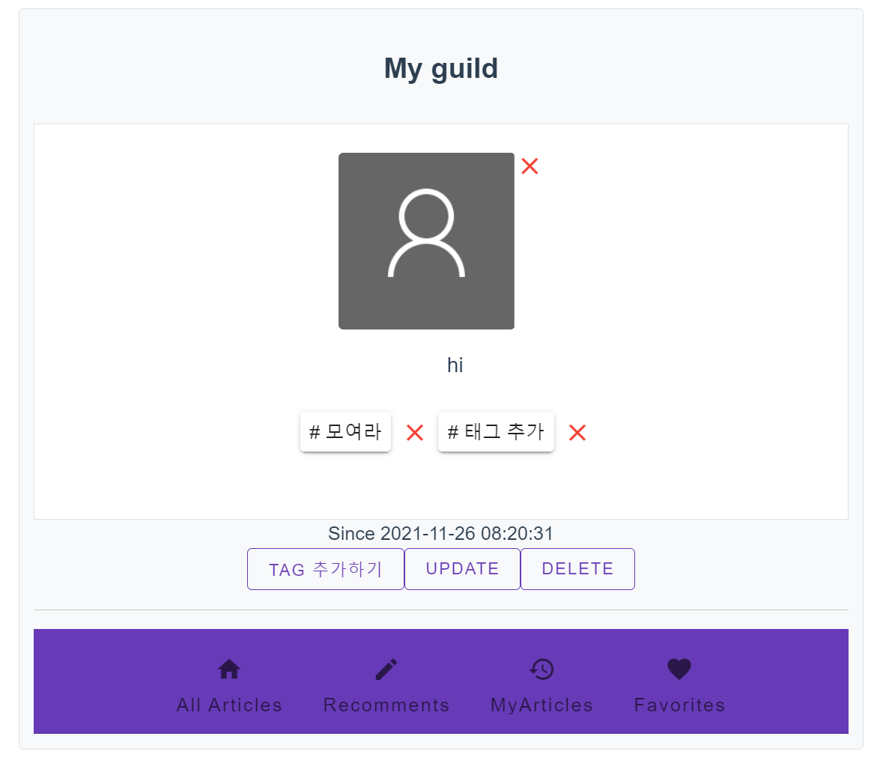

### 다른 길드에 가입 신청 

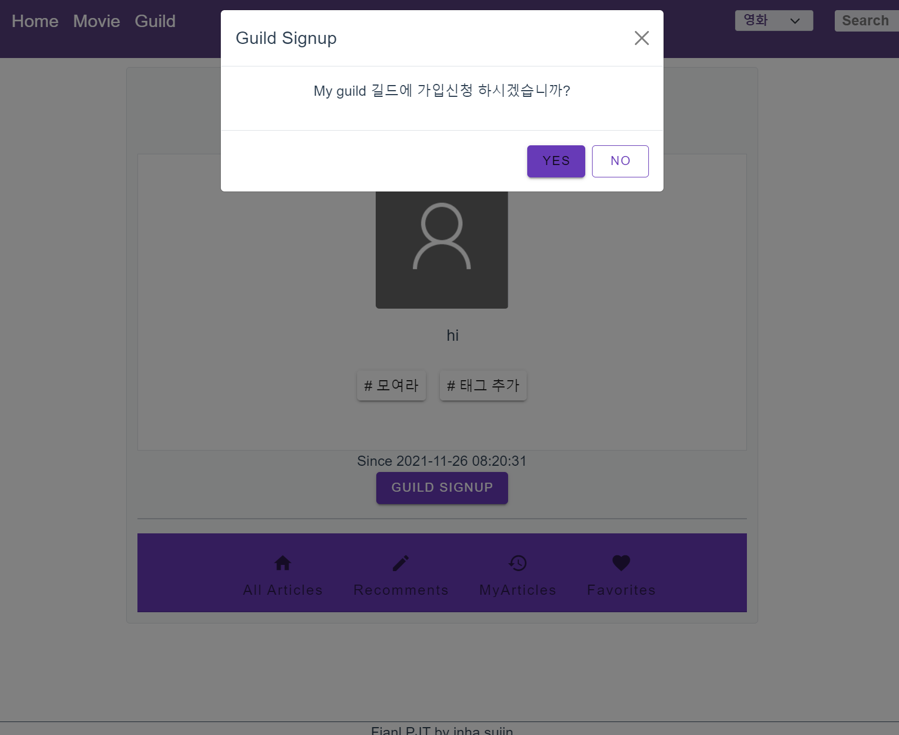


### My profile의 My Alram에  길드 가입 신청 알람 확인 가능(이 외에도 내 글을 리코멘트, 좋아요 하는 경우 알림)

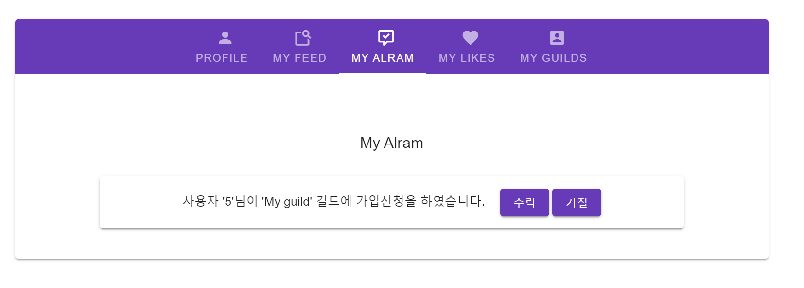


## 5. 문제 해결 과정 및 느낀 점

### 21-11-15

- __아이디어 회의__ 

- 영화 덕질 공간

- 영화 커뮤니티의 아이덴티티 결정 (페르소나, 보라색)

  - 페르소나 

    - 그리스 어원의 ‘가면’을 나타내는 말로 ‘외적 인격’ 또는 ‘가면을 쓴 인격’

    - 영화에서 페르소나는 종종 **영화감독 자신의 분신이자 특정한 상징을 표현하는 배우**를 지칭
    - UX 디자인에서 페르소나란 제품(웹/앱 등의 디지털 프로덕트)의 **가상 고객 프로파일**을 일컫는 말

- NAV BAR 구성

- 희망 구현 기능

- 교수님께 여쭤볼 것 정리 (장고 ,vue, 음성기반 구현 가능성)

---

### 21-11-16

- __목업 & 아이덴티티 구체화__
- 레이아웃 구체화
- 상세 기능 회의
- 필요 데이터 구체화


---

### 21-11-17

- __리드미작성__

- 요구사항 정리

- 데이터 정리(인풋 아웃풋) 

- 데이터 모델링

- 인터페이스 정의(함수)

- 역할분담(프론트, 백엔드)


####  데이터 정리 및 계획 at Notion

> https://www.notion.so/bb08dc6140df4dd4955e185bc9562ad8?v=cf5571cb869545d29fafbb5e7090f535

---

## 21-11-18

- __데이터 모델링(ERD)__
- 역할분담
- 기본설정
- 프로젝트 생성 및 브랜치 


#### __초기 모델링__


---

## 21-11-19 ~ 25

- 기능구현
- CSS

---

### 느낀점 : 이수진


```
프로젝트 초반부터 모델링이 중요하단 얘기를 많이 들었어서 ERD에 굉장한 공을 들였습니다. 
그럼에도 Serializer의 read_only, write_only 에 굉장히 헤맸습니다.
Fk,MTM 등이 있을 때 고려해 주어야할 사항이 많았습니다.
특히 M:N일때 중계 테이블에 저장하기 위해 어떻게 해야 하나 고민하다 중계모델을 만들어 Through로 작성하여 해결하였습니다.

비동기 요청과 섞일때 순서가 뒤엉키는 부분에서도 많은 에러를 접했습니다.
일일히 콘솔창에 어디서 어떤 데이터를 찍는지 같이 남겨가며, 차근차근 데이터의 흐름을 따라갔습니다. 그러다가 콘솔에 찍히지 않거나 다른 값이 찍히면 그 부분을 파고들었습니다. 
요청 자체는 올바를 때는 views.py 내에서 print(request.data) 등 또 직접 터미널창에서 확인해보며 수정하였습니다. 

위의 사진은 이용자에게서 사진이미지를 받아 DB에 저장하기 위해 시도하며 만났던 오류였습니다. 파일을 입력받아 DB에 저장하는 것에 FILES등 좀 더 주의를 기울여야할 점이 많았습니다. 

또한 null, blank 등에 대해서도 필드를 고려할 때 미리 잘 생각해두어야 한다는 것을 깨달았습니다. 필수값이 들어오지 않아 나는 에러를 수없이 접하고 다시 DB를 날리고 migrate하였습니다..
그뿐만 아니라 데이터의 형태에 대해서도 많이 미숙하였다는 것을 깨달았습니다.
시리얼라이저가 언제 필요한지 왜쓰는지를 이제야 비로소 조금이나마 감을 잡았습니다. 

CSS가 미숙하여 맨처음 보기쉽게 테두리에 색을 주어 배치하였습니다.
템플릿을 끌어오기에도 코드와 맞지않아 일일히 지정해주다보니 시간이 많이 소요되었습니다.

시간이 조금만 더 있었다면 싶은 마음이 내내 들었습니다.
프로젝트를 하며 생각보다 정말 배운 것이 많다는 것을 깨달았습니다. 
 잊지 못할 일주일을 보냈습니다..Thanks SSAFY..
```


## 정인하

시간을 오래 소비했던 오류나 기능들에 대해서 간략하게 정리해보았습니다.

1. login, admin 권한으로만 볼 수 있는 페이지가 존재하였습니다. 새로고침을 하면 했을 때도 superuser 여부를 계속 보여주기 위해 자주 필요한 유저 정보들은 login을 할때 local storage에 jwt token을 저장해주는 방식으로 로그인시 local storage에 저장해주고 logout 시에 삭제하는 방식을 사용하였습니다.

   장고에서 제공해주는 signup, login 폼이 아닌 vue에서의 폼을 쓰느라 validation체크를 하는데 시간을 많이 쏟았습니다. 여러 문서를 참조하여 user이름이 기본 user이름과 중복되지 않고 필수 값을 입력하지 않았을 때, 또는 이메일에서 형식이 다른 입력이 들어왔을 때, 비밀번호를 폼에서 바로 일치여부를 comfirm하는 signup/ login 폼을 만들 수 있었습니다.

   

2. 사용자가 nav bar의 search input에서 원하는 영화를 입력 했을 때 해당 사이트 DB 내에 있는 영화도 보여주고 없는 영화도 TMDB 요청을 통해 보여주되 있는 영화는 클릭시 영화 상세페이지로, 없는 영화는 요청시 admin에게 영화 등록을 요청하는 폼을 보내줄 수 있도록 해주었습니다. 
   다음 오류는 이때만 마주한 것은 아니지만 이때 처음으로 마주한 에러였습니다.


​	nav search bar에서 영화를 검색하면 라우터 푸쉬를 통해 Movies인 곳으로 이동하도록 설	정하였는데 현재 페이지가 Movies인 경우 위와 같은 에러가 발생하였습니다.

​	이 해결을 위해 처음에는 this.$route.name으로 현재 있는 페이지의 이름을 가져와 if문으로 	위 에러를 잡았으나 나중에는 catch를 이용하였습니다.


3.  해당 오류는 쉽게 해결할 수 있었는데 시간이 오래 걸렸고 프로젝트를 진행하면서 많이 했

   vue에서 딕셔너리에 접근할때 .을 사용하셔 접근해서 django의 views.py에서도 .을 써서 접근하다가 오류를 많이 만났습니다. -> request.data['title']로 접근하여 해결하였습니다.

   

4. 이 오류 역시 프로젝트 기간에 2-3번 정도 발생했던 오류 입니다.

   

   url 요청할 때 data로 val값을 보내줬는데 서버에서 request.data로 접근이 안된다는 이슈가 있었습니다. views.py에서 아래와 같이 print를 찍어서 디버깅해보니 빈값이 들어오는 것을 발견할 수 있었습니다.

   

   

   해결방안-> 데이터가 단순한 한자리 자연수라 url에 실어서 보내주어 해결하였습니다.


5. 다음은 해결하는데 시간이 꽤 오래 걸렸고 모달 창을 부트스트랩에서 이해하지않고 긁어와서 쓰다가 발생한 이슈입니다.

   

   상위 컴포넌트로 받은 api_movie가 modal 폼에 접근하면서 접근이 안되는 것을 발견 for문을 돌렸는데 클릭해서 modal을 띄어보면 가장 첫번째 값만 반영됨을 확인 할 수 있었습니다. 

   

   위 컴포넌트에서 for문 돌리는데 이때 모달 target 이름이 상수값으로 똑같이 되어있어서 3번째 영화를 눌러도,  4번째, 5번째 영화를 눌러도 첫번째 영화에 대한 모달창이 뜨는 것이었습니다.

   해결 -> 모달 타겟값을 변수로 지정(고유한 api_movie.id 값)하여 해결하였습니다.

   


​	6. collection에 연결된 태그들을 수정하고 삭제하는 데 많은 시간이 걸렸습니다. 처음에는 

```python
for movie in movies:
            collection.movies.add(movie)
```

아래와 같이 무비 리스트를 for문으로 돌면서 movie[id]를 넣어줬다가 안돼서 위와 같이 변경하였음에도 안돼서 아래 코드와 같이 수정하였습니다.


### 프로젝트를 마치며..

```
처음 프로젝트를 시작할 때 일주일이 너무 짧을 것 같다는 생각을 했는데 역시나 시간이 너무 짧아서 아쉬웠습니다. 페어와 함께 구상한 것들을 다 해보지 못해서 시간이 조금만 더 있었으면 좋겠다는 생각을 했습니다. 처음에 본격적으로 프로젝트를 시작하기 앞서서 페어와 함꼐 프로젝트 주제에 대해 이야기 하곤 했었는데 열정적인 페어를 만나서 함께 열심히 할 수 있어서 너무 좋았습니다. 
프로젝트를 진행하면서 이런 걸 언제 배웠나 싶은 것들도 많이 마주하게 되었고 새로운 것들도 많이 알게 되었습니다. 무엇보다 5개월이라는 짧은 시간동안 배운 것이 많은 것 같아 뿌듯했습니다. 동시에 프로젝트를 해보니 아직 갈 길이 멀고 배움에 끝이 없다는 생각도 했습니다. 이론으로 배우고 워크샵, 홈워크, 관통 PJT로 조금씩 해보던 실습을 뛰어넘어서 하나의 웹사이트를 구현한다는게 시작 전에 많이 걱정되었으나 페어와 함께 남들보다 조금 늦은 것 같더라고 모델리에 많은 신경을 쓰고 많은 생각을 했습니다. 그런 덕분인지 프로젝트를 진행하면서 한번도 모델링을 새로 해야하는 경우는 없었습니다. (한 두개의 필드를 추가하는 경우는 있었습니다!) 교수님들이 조언해주시고 추천해주시는 순서대로 목업부터 모델링까지 하면서 다른 팀들이 구현을 시작할때 저희 조는 시작하지 않아서 너무 늦쳐지나 생각도 했었는데 지금 생각해보면 그런 과정이 있었기에 보다 수월하게 프로젝트를 진행하지 않았나 생각이 듭니다. 일하기를 마치는 최종 프로젝트를 통해서 그 어느때보다 많은 것들을 배울 수 있었습니다. 아쉬운 점은 시간이 없어서 원했던 기능을 다 구현하지 못했던 것과 최적화를 하지 못 했다는 것이 아쉽습니다. 
```

